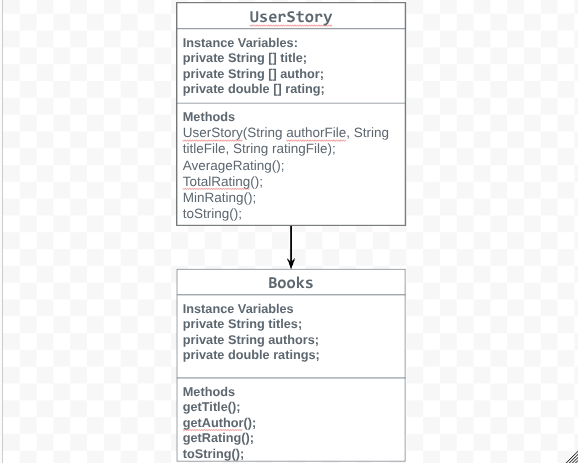

Unit 3 project with Danica Little

# Unit 3 - Data for Social Good Project

## Introduction

Software engineers develop programs to work with data and provide information to a user. Each user has different needs based on the information they are looking for from data. Your goal is to create a data analysis program for your user that stores and analyzes data to provide the information they need.

## Requirements

Use your knowledge of object-oriented programming, one-dimensional (1D) arrays, and algorithms to create your data analysis program:
- **Write a class** – Write a class to represent your user or business and store and analyze their data with no-argument and parameterized constructors.
- **Create at least two 1D arrays** – Create at least two 1D arrays to store the data that your user needs information about.
- **Write a method** – Write a method that finds or manipulates the elements in a 1D array to provide the information your user needs.
- **Implement a toString() method** – Write a toString() method that returns general information about the data (for example, number of values in the dataset).
- **Document your code** – Use comments to explain the purpose of the methods and code segments and note any preconditions and postconditions.

## User Story 

As an Book Enthusiast, I want to promote high rated books so that people become interested in reading more books and helping with the issue of bookstore closing.

## Dataset 

Dataset: https://www.kaggle.com/datasets/valakhorasani/best-books-of-the-decade-2020s
- **Book name** (String) - name of books
- **Author** (String) - author of books
- **Rating** (double) - rating of each book

## UML Diagram 

 

## Description 

In our project, both Danica and I decided on the user story of a book Enthusiast and we sought to promote reading and increase the popularity of book stores. Our class in the code, "UserStory," instead of using an intializer list, we used data from the text files from the data we found on Kaggle.com. We used 1D arrays called title, author, and rating filled with data from the files. we used a nested loop in a method called MinRating, to go traverse each index and check if the rating in that index is greater than 4.20. It will then display the book and rating. This method alone allows the user to find recommended books are rated-high. Additionally, we have two seperate methods to calclate the average of the total ratings. TotalRating and AverageRating which take the values of ratings in each index and adds them toegther, and averageRating divides them by the length.